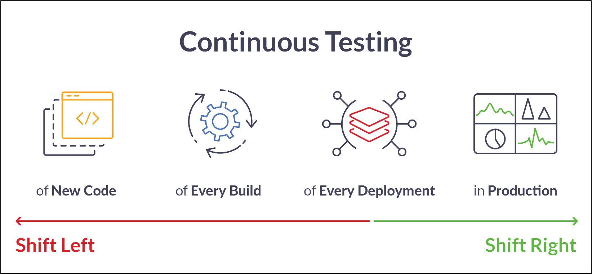

---

### The Pretty _Funky_ Pipeline


---?image=https://dt-cdn.net/images/continuous-delivery-664cf921f9.svg&size=auto 70%&color=white

---?image=cicd-tools-interactions.png#2&size=auto 90%&color=white

---?image=sd-pipeline-v2.png&size=auto 60%&color=white

---?image=sd-pipeline-v2.png&size=auto 70%&color=white


---?color=white&size=auto 90

@div[left-70]
<br>

@divend

@div[right-30]
@ul[brighten]
* What are we talking about really?
* Service Integration onto Pan-Net platform.
* Service Management once in production?
* SIAM anyway? :)
* VNF Orchestration
* VNF-as-Code
* Integrated QA
@ulend
@divend

---?image=sd-pipeline-v2.png&size=auto 70%&color=white


---?image=sd-pipeline-v2.png&size=auto 70%&color=white


---?image=sd-pipeline-v2.png&size=auto 70%&color=white



---?image=sd-pipeline-v2.png&size=auto 70%&color=white


---?image=gitflow-branch-env-mapping.png&size=auto 90%&color=white

---

`gitlab-ci.yml` stages

```yaml
stages:

  # ---- development -----------
                                #
  - 'dev:prepare'               #
  - 'dev:deploy'                #  Feature Development
  - 'dev:validate-deployment'   #    - Functional Testing
  - 'dev:test-features'         #
  - 'dev:teardown'              #
                                #
  # ---- CI/QC/QC --------------
                                #
  - 'qa:req_resources'          #  Feature Integration
  - 'qa:deploy'                 #    - Functional Testing
  - 'qa:validate-deployment'    #    - Branch Stabilization
  - 'qa:test-ci'                #    - Bugfixing
  - 'qa:test-bugfix'            #
  - 'qa:destroy'                #
  - 'qa:rel_resources'          #
                                #
  # ---- staging ---------------
                                #
  - 'stage:deploy'              #  Release Readiness
  - 'stage:validate-deployment' #    - Functional Testing
  - 'stage:test-regressions'    #    - Non-Functional Testing
  - 'stage:test-performance'    #    - Acceptance Testing
  - 'stage:test-system'         #    - Hotfix Engineering
                                #
  - 'stage:test-hotfix'         #  Hotfix testing
                                #
  # ---- production ------------
                                #
  - 'prod:deploy'               #  Production Deployments
  - 'prod:validate-deployment'  #    - Release deployments
                                #    - Hotfixes
  # ----------------------------
                                #
```

---

`gitlab-ci.yml` example deployment job

```yaml
'dev:deploy':
  stage: 'dev:deploy'
  environment:
    name: $CI_ENVIRONMENT_TYPE/$SITE/$CI_COMMIT_REF_NAME
    url:  $URL
  variables:
    TASK:                deploy
    CI_ENVIRONMENT_TYPE: dev
    DATACENTER:          IC-HRZAGT1
    SITE:                dev.pfp.local
    URL:                 http://dev.pfp.local
    ORCHESTRATOR_URL:    http://ao.pfp.local
  allow_failure: false
  script:
    - ./bin/ci-run  "$TASK" "$CI_ENVIRONMENT_TYPE" "$SITE"
  only: ['/feature/*/']        # <-- Varies in each environment
  tags: ['vnf-cicd-demo']
```

---

`gitlab-ci.yml` example test invocation job

```yaml
'dev:test-features':
  stage: 'dev:test-features'
  environment:
    name: $CI_ENVIRONMENT_TYPE/$SITE/$CI_COMMIT_REF_NAME
    url:  $URL
  variables:
    TASK:                test-features
    CI_ENVIRONMENT_TYPE: dev
    DATACENTER:          IC-HRZAGT1
    SITE:                dev.pfp.local
    URL:                 http://dev.pfp.local
    CI_TEST_TAGS:        'features'   # <-- CSV list, varies in each env.
  allow_failure: false
  script:
    - ./bin/ci-test "$CI_TEST_TAGS"
  only: ['/feature/*/']               # <-- Matches deploy job in env.
  tags: ['vnf-cicd-demo']
```

---?color=white&size=auto 90

### @color[gray](Pipeline characteristics)

@div[left-70]
<br>

@divend

@div[right-30]
@ul[brighten]
* Facilitates continuity
* One codebase (IaC)
* Separation of concerns
* Cont. Development
* Cont. Integration
* Cont. Validation
* Cont. Operations
@ulend
@divend

---


---?color=white&size=auto 90

### @color[gray](Pipeline characteristics)

@div[left-70]
<br>

@divend

@div[right-30]
@ul[brighten]
* Cont. Testing
* When? How Often?
* What?
* Everything that is a _risk_.
* All changes, no matter how small.
@ulend
@divend

---

* Code
  * Git repo - the source/authority of truth.
  * GitOps
  * Insurance policy!!

---

* Facilitates continuity
  * Good separation of concerns - from the same codebase (IaC)
  * Continuous Development & Integration
  * Continuous Validation (Stakeholders, BAs/POs)
  * Continuous Operations
  * Continuous Testing
    * When? How Often?
    * What?
      * Everything that is a _risk_.
      * All changes, no matter how small.

---

* Builds QA into the deliverable
  * Maintains -> Increases QA over iterations
  * Builds confidence in the deliverable and process

---

* Smooth delivery/Quick feedback
  * Problems fail the pipeline. _Fail fast/early_
    * Prevention is better than cure!!
  * Every change brings value - and _risks_
    * Increasing costs to fix the longer issues remain
    * CI requires the _right_ foundation
  * Risk reduction (quantification)

---

---

## Deployments

* Ephemeral deployments
  * Throwaway and build an env everyday (CI)
  * environments as cattle not environments as pets!
* frequency reduces difficulty
  * controlled repetition == managed risk
* Uses the same process in every environment
  * Consistency, Consistency, Consistency!!
    * Testing relatively unaffected by external factors
  * Environment Fidelity needed (fresh envs guarantee this)

---

## So, Why pipeline?

* Will it launch? And does it launch well? How far does the rocket go?
  * Know the answer before liftoff
  * Not midway through the real mission.
* CI/CD to deliver any version at any time
  * Not necessarily deploy the version delivered
  * Deployments decoupled from deliveries

---

## So, Why pipeline? ...

* Security?
  * DevSecOps accomplished via API call to nexpose, etc - on-demand in any env.
* Integrated Monitoring?
  * Monitor the pipeline itself!
  * Monitor the deliverable (VNF) too!

---

## So, Why Pipeline?

* Short(er) lead-times
  * Service Integrations
  * Features/Changes
  * Bugfixes/Hotfixes
  * Upgrades

---

## So, Why Pipeline?

* Innovating in a complex climate
  * Not all features reach prod!!
    * A/B Testing, Hypothesis testing artefacts are throwaway!
* Smaller changes == lower risk!
  * Rollbacks/repeals/deprecations are easier to manage.
  * Major upsets avoided!

---

## So, Why pipeline? Testing ...

* Assuring a high quality deliverable
  * Consistently!
  * QA increases proportionally to iterations.
  * TDD/BDD guide solution - instead of tests fitting solution.
  * Test coverage maximised with TDD/BDD and Continuous Testing.
* Keeping customers (Stakeholders, Project, NatCo, Platform, Admins, etc) happy
  * Nirvana!!

---

## So, Why pipeline? ...

* Minimal manual interactions
  * GitOps
* Nirvana!!

---

## Gotchas

* It's possible to deliver the _wrong_ thing.
* It's possible to break things (and not realize it).

* CI/CD == As good as the inputs == Garbage-in/Garbage-out

* Continuous Testing should _shift-left_ into requirements
  * Requirements can be tested, believe it or not!
* Stakeholder input? Early? Before dev?
  * Mostly always a good thing!!

---

## Gotchas

* But there are too many environments?
  * Production is given!
  * Staging is given!
    * Expensive testing, time consuming (~hours/days/weeks)
    * Small issues must be avoided before they reach here!
  * Dev allows _clean-room_ development and testing
    * env. noise and cruft can taint dev
  * QA/QC/Testing is needed to integrate multiple dev outputs
    * Fail-fast, fail-forward

---

## Gotchas

* But there are too many release gates?
  * Yes, continuous delivery == short cycles _not_ all-the-time!
  * Manual oversight == sleep well at night, worth it!

* But there are too many branches?
  * Just like there are many rooms in an office!
  * Or many conveyor belts on a factory floor!
  * Continuous dev + Continuous test + Continuous validation + Continuous Ops
    * In parallel as well!
    * All in one code-base!

---

## Gotchas

* But I may need to manually change something in prod!
  * This is risky! Goes against IaC
  * No! Follow the hotfix process (that's the short circuit to prod!)
  * Yes! P1s/Emergencies, But change must be brought back into code
    * And deployed back to staging for verification
  * Pipeline discipline over time _will_ reduce need for hotfixes.

---

## Summary

The only impossible journey is the one that never begins

* Make it work!
* Make it work correctly!
* Make it work fast!

---

https://www.thoughtworks.com/insights/blog/5-traits-good-delivery-pipeline

