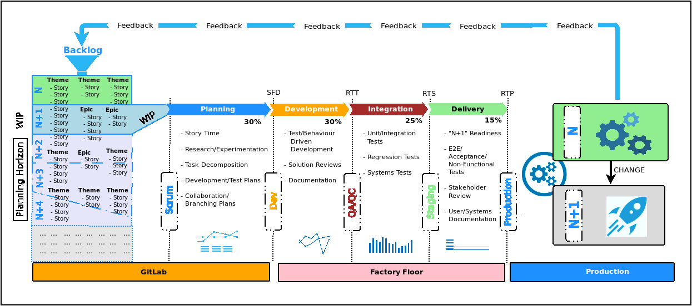

---

### The Pretty _Funky_ Pipeline

---?image=https://dt-cdn.net/images/continuous-delivery-664cf921f9.svg&size=auto 70%&color=white

---?image=cicd-tools-interactions.png&size=auto 90%&color=white

---?image=sd-pipeline-v2.png&size=auto 60%&color=white

---?image=sd-pipeline-v2.png&size=auto 70%&color=white

---?image=sd-pipeline-v2.png&size=auto 70%&color=white

---?image=sd-pipeline-v2.png&size=auto 70%&color=white

---?image=sd-pipeline-v2.png&size=auto 70%&color=white

---?image=sd-pipeline-v2.png&size=auto 70%&color=white

---?color=white&size=auto 90

@div[left-70]
 

@divend

@div[right-30]
@ul[brighten]
* Service Integration
* Service Management
* SIAM?
* VNF Orchestration
* VNF-as-Code
* Integrated QA
@ulend
@divend

---?image=gitflow-branch-env-mapping.png&size=auto 90%&color=white

---?image=cicd2-project-view.png&size=auto 65%&color=white

---?image=sd-pipeline-v2.png&size=auto 65%&color=white

---?color=white&size=auto 90

### @color[gray](Pipeline characteristics)

@div[left-70]
 

@divend

@div[right-30]
@ul[brighten]
* Facilitates continuity
* One codebase (IaC)
* Separation of concerns
* Cont. Development
* Cont. Integration
* Cont. Validation
* Cont. Operations
@ulend
@divend

---?color=white&size=auto 90

### @color[gray](Pipeline characteristics)

@div[left-70]
 

@divend

@div[right-30]
@ul[brighten]
* Cont. Testing
* When? How Often?
* What?
* Everything that is a _risk_.
* All changes, no matter how small.
@ulend
@divend

---

---

---

---

[frequency reduces difficulty]

Characteristics of good CI/CD

https://www.thoughtworks.com/insights/blog/5-traits-good-delivery-pipeline

---

* Code
  * Git repo - the source/authority of truth.
  * GitOps
  * Insurance policy!!

* Facilitates continuity
  * Good separation of concerns - from the same codebase (IaC)
  * Continuous Development & Integration
  * Continuous Validation (Stakeholders, BAs/POs)
  * Continuous Operations
  * Continuous Testing
    * When? How Often?
    * What?
      * Everything that is a _risk_.
      * All changes, no matter how small.

* Builds QA into the deliverable
  * Maintains -> Increases QA over iterations
  * Builds confidence in the deliverable and process

* Smooth delivery with a Quick feedback loop
  * Problems should be known ASAP. _Fail fast/early_
    * Prevention is better than cure!!
  * Every change brings value - and _risks_
    * Increasing costs to fix the longer issues remain
    * CI requires the _right_ foundation
  * Risk reduction (quantification)

* Minimal manual interactions
  * GitOps

* Uses the same process in every environment
  * Consistency, Consistency, Consistency!!
  * Insurance policy!!
  * Frequency reduces difficulty!
  * Environment Fidelity

* Can deliver any version at any time
  * Not necessarily deploy

* Security?
  * DevSecOps!

* Integrated Monitoring?

* Will it fly? And fly well?

[smooth]
[fail fast]
[testing]
  * When
  * How often?
[feedback]

---

Why?

Assuring a high quality deliverable
Keeping customers happy
Keeping admins happy
  * Project
  * Platform
Short lead-times
  * Service Integrations
  * Features/Changes
  * Bug fixes
  * Upgrades
Innovating in a complex climate

---

CI/CD the key?

Yes

Automation
Consistency
Version Control
Change Control

---

No

Only part of the story

CI/CD == As good as the inputs
CI/CD == Garbage-in/Garbage-out

It's possible to deliver the _wrong_ thing.

It's possible to break things (and not realize it).

---

How do we deliver the _right_ thing?

CT
Good feedback loops
Avoiding the pitfalls - manual changes

---

CI

When engineers branch of mainline, work in a clean room and integrate changes back
_continuously_.

---

CD

When the mainline branch is always builable/deployable.

---

How often is _continuous_?

Variable. Depends on complexity of the deliverable, external factors.

We have to support this variability, but ensure the _correct_

https://sdtimes.com/wp-content/uploads/2017/09/Screen-Shot-2017-09-08-at-2.46.10-PM.png

Continuous Testing

Simple view
https://cdn-images-1.medium.com/max/1200/1*6WSm4DEcxYwf4-wDuh_wLQ.png

Test view
https://www.accenture.com/t20150923T092203Z__w__/us-en/_acnmedia/Accenture/Conversion-Assets/Blogs/Images/5/Accenture-Continuous-Delivery-Vs-Continuous-Deployment.pngla=en?la=en

Shift Left
https://www.kovair.com/blog/wp-content/uploads/2017/12/blog-graphics-12-1.jpg

Ideas to extend this
https://static1.squarespace.com/static/54dc6222e4b033be8f10b195/t/57547113d51cd4cfabfe3c5d/1465151827081/

Managers View
https://www.scholarwebservices.com/wp-content/uploads/2017/06/457-image-for-devops-part-of-blog_new-way_560x560.png

Engineers View
https://devops360.files.wordpress.com/2016/09/delivery_pipeline.png

---

* Make it work!
* Make it work correctly!
* Make it work fast!

---

